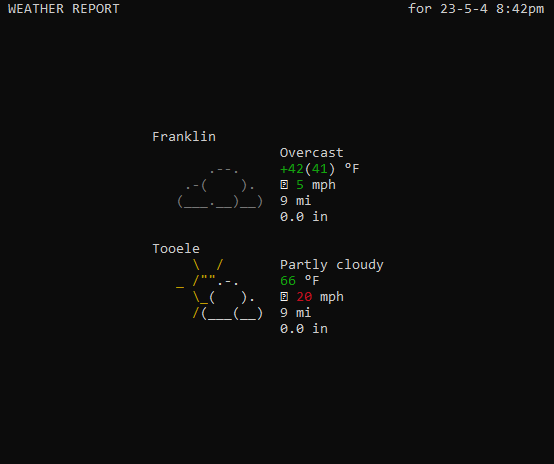

A simple console program to display updated weather information for one or more locations, using [wttr.in](https://wttr.in) as a backend.



# Configuration

Weatherman is configured in `~/.config/weatherman/weatherman.json`. The configuration file will look something like this:

```json
{
  "locations": [
    ["Norwich Tennessee", "Norwich"],
    ["Sandy Gulch California", "Sandy Gulch"]
  ],
  "interval": 600
}
```

`locations` are given as an array of two strings. The first is the full location query, the second is a short name used to display the location.

`interval` is given in seconds and represents the time between updates.